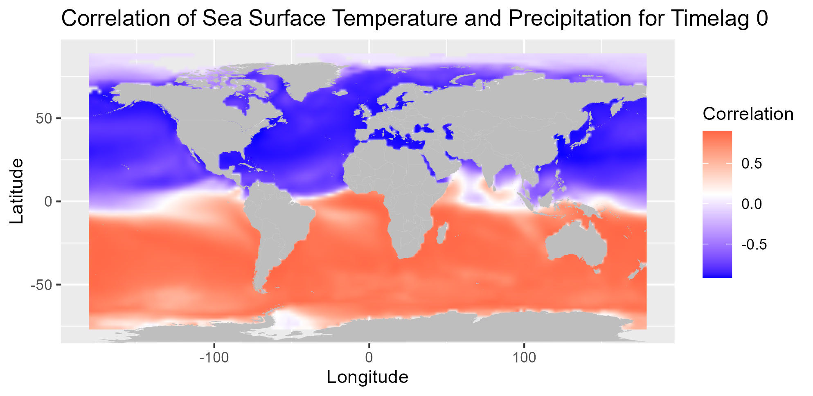
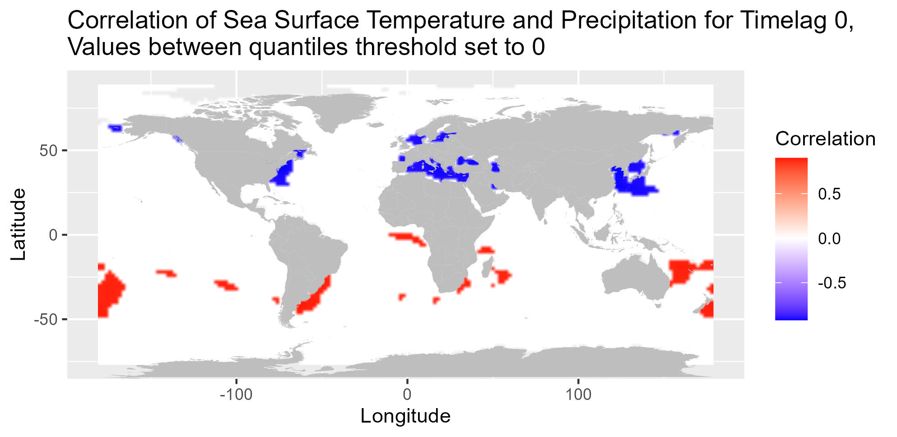
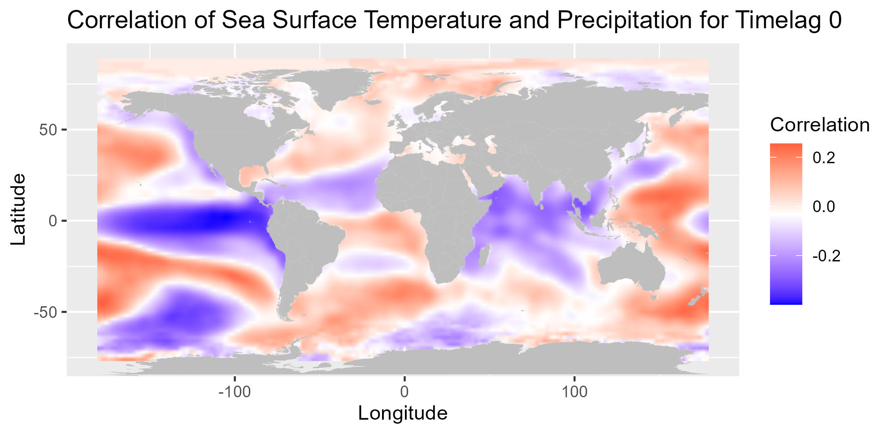
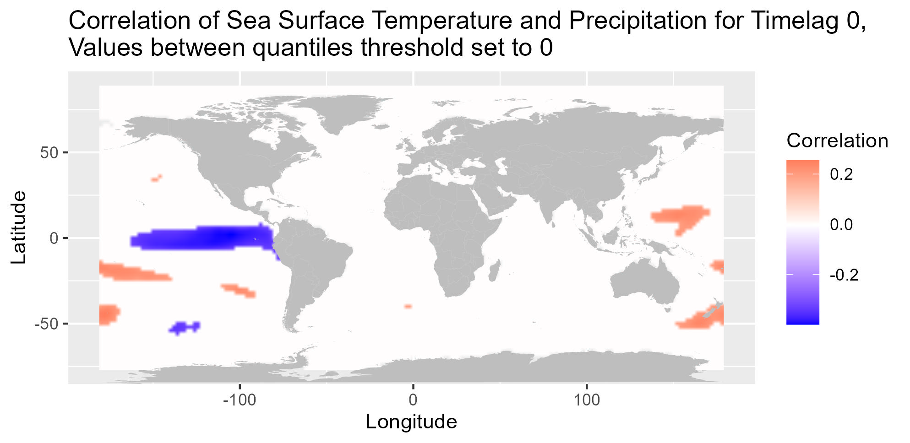
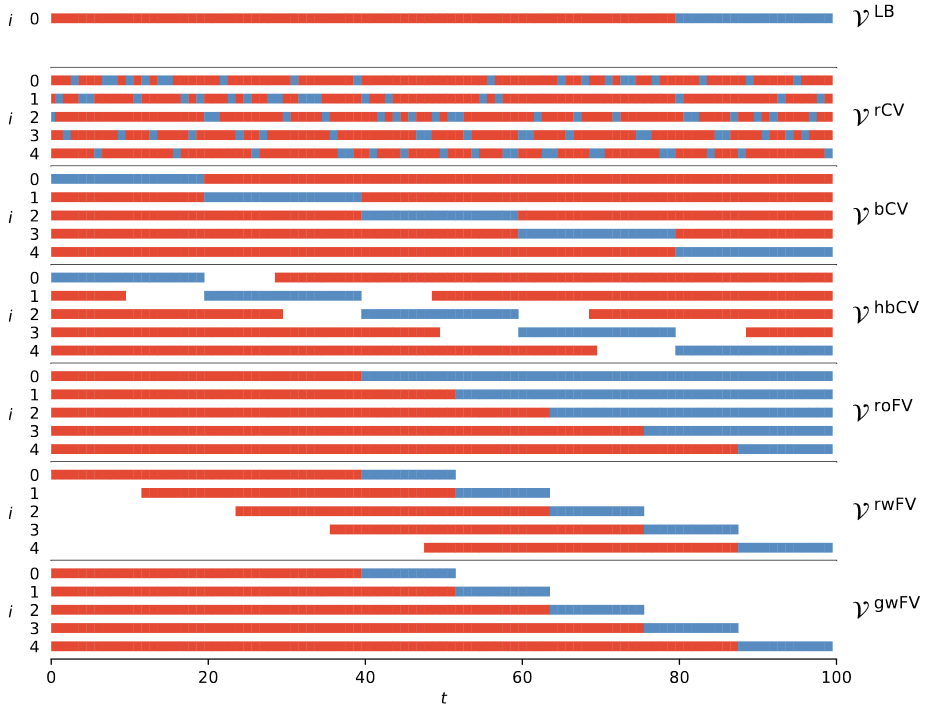
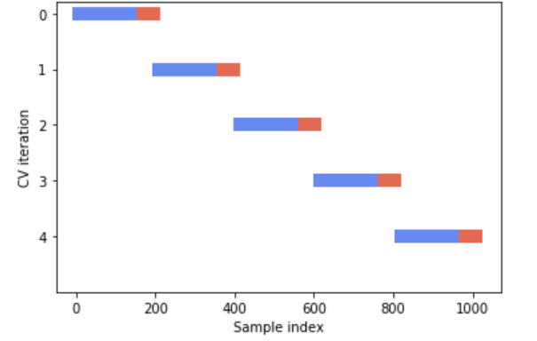
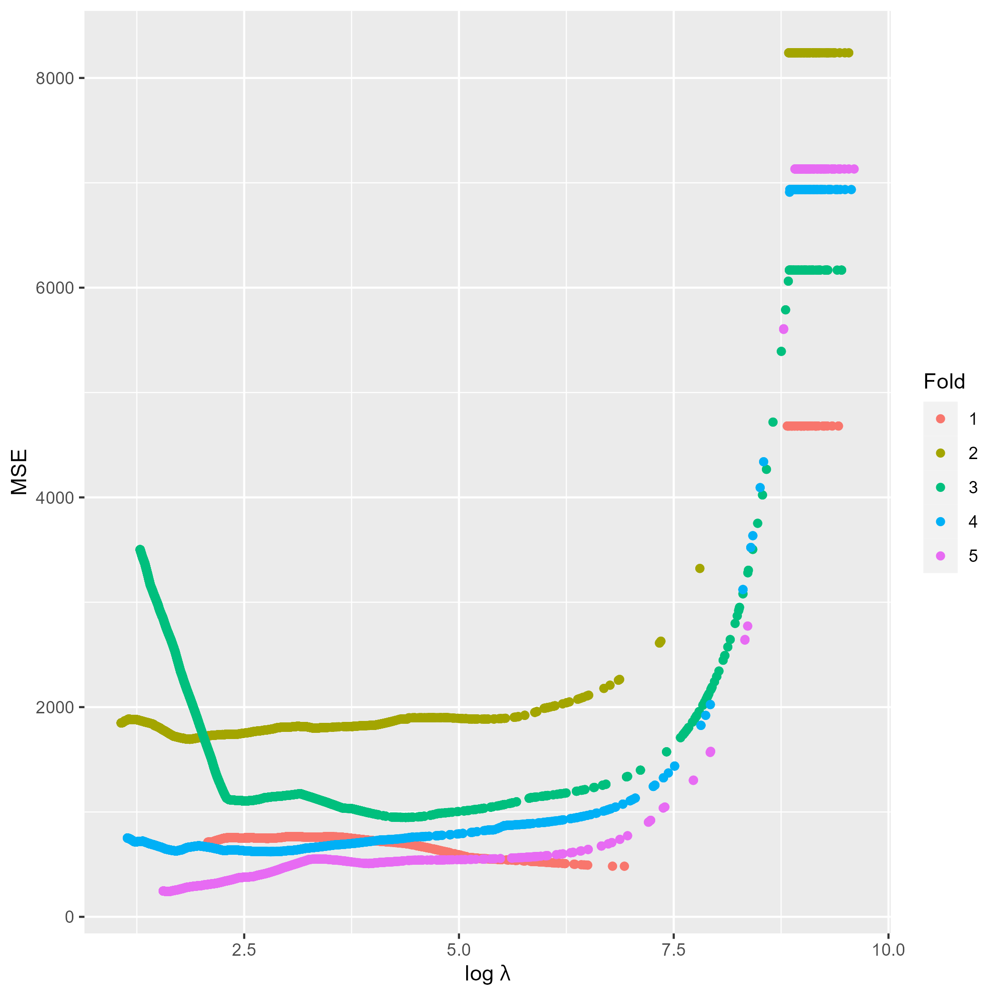

```{r, echo = FALSE}
knitr::opts_chunk$set(warning = FALSE, message = FALSE, echo = FALSE)
```

```{r}
source("../code/R/helper-functions.R")
```
```{r}
library(ggplot2)
library(patchwork)
library(gridExtra)
```

## Outline

\tableofcontents

```{r}
# 25-30 minuten, also wsl maximal 40 slides

# always explain motivation for each step
# explain methods 
# explain results

# Notes in general 
# Greetings, main title slide
# Slides with table of contents
# Motivation
## Amazonas huge ecosystem important carbon sink
## droughts in the amazonas affect millions of livelihoods
## predicting droughts and precipitation is important problem
## incoming: ciemer et al.

# Related work
## Ciemter et al created early warning systems based on SST alone
## show and explain cross degress
## first only cross degrees with
## show and explain early warning signal 

# Explorative Analysis
## Precipitation how much?
## glyphs definitely
## SST maybe

# Correlation analysis
## different timelags
## show differences of raw and deseasonalized data

# Clustering analysis
## compare k-means ad k-medoids
## show clusters on map
## show results for the 5 clusters
## show only predicted values of the final clusters

```


# 1. Introduction

## Motivation

- The Amazon basin is a key hotspot of biodiversity, carbon storage and moisture recycling

- Hydrological extremes affect ecosystem and populations tremendously

- Droughts in the Amazon rainforest can have severe biomass carbon impact 

- Severe Amazon drought in 2010 had total biomass carbon impact of $2.2$ $PgC$, affected area $3 \textit{ mio } km^2$


## Related work

- @ciemer2020early established an early warning indicator
for water deficits in the central Amazon basin (CAB)

```{r cross, echo = FALSE, fig.align = 'center', out.width = '50%', fig.cap='Cross degree between sea surface temperature and continental rainfall anomalies. (Ciemer et al. (2020))'}
knitr::include_graphics("../figures/cross-degree.jpg")
```

- They investigated the correlation over time of NTAO and STAO
and its relationship to droughts in the  CAB


## Early warning signal 

```{r early, echo = FALSE, fig.align='center' ,out.width='75%', fig.cap='Early-warning signal for droughts in the central Amazon basin Ciemer et al. (2020).'}
knitr::include_graphics("../figures/early-warning-signals.jpg")
```

## Our Approach

- Inspect spatial and temporal characteristics in the raw data
- Fit different models to predict precipitation directly from SST
- Apply the lasso and fused lasso with different parameter settings (@tibshirani1996regression, @tibshirani2005sparsity)
- Evaluate the models with forward validation for time series


# 2. Explorative analysis

## The Data

- Rain data from CHIRPS (Climate Hazards Group InfraRed Precipitation woth Station data, @funk2015climate)
- CHIRPS derived from in-situ and satellite data
- SST data from ERSST (Extended Reconstructed Sea Surface Temperature, @huang2017noaa)
- ERSST is reanalysis of observation data (made by ships and buoys for example), missing data filled by interpolation techniques
- These are the same data sets as in @ciemer2020early

## Explorative Analysis Rain

```{r CAB, echo=FALSE, fig.cap="Location of the area under study. The central amazon basin (CAB) spanning across 0,-10 latitude and -70,-55 longitude", fig.align='center',out.width='50%'}
cab_square_plot <- readRDS("../results/eda/cab_square_plot.rds")
cab_square_plot + ggtitle("Location of area under study, central Amazon basin (CAB)")
```

## Precipitation, Mean and SD

```{r , fig.cap="Precipitation mean at each location. The mean was computed over the whole time period"}
precip_means_loc_plot <- readRDS("../results/eda/precip_means_loc_plot.rds")
precip_means_loc_plot$labels$title <- NULL
precip_means_loc_plot$labels$fill <- "Mean"
# precip_means_loc_plot
# precip_means_loc_plot + theme(panel.background = element_rect(fill='transparent'),
#          plot.background = element_rect(fill='transparent', color=NA),
#          panel.grid.major = element_blank(),
#          panel.grid.minor = element_blank(),
#          legend.background = element_rect(fill='transparent'),
#          legend.box.background = element_rect(fill='transparent'))
# precip_means_loc_plot + scale_fill_gradient2(low="brown", high ="dark green", midpoint = mean(precip_means_loc_plot$data$val, na.rm = TRUE))
```

```{r, fig.cap="Precipitation standard deviation at each location. The standard deviation was computed over the whole time period"}
precip_sds_loc_plot <- readRDS("../results/eda/precip_sds_loc_plot.rds")
precip_sds_loc_plot$labels$fill <- "SD"
```

```{r, mean-sd-precip, fig.cap= "Mean and standard deviation at each location. The standard deviation was computed over the whole time period. The white lines on the legend at each side of the plots indicates the mean of the respective quantity.", fig.align='center', out.width='50%'}
p <- precip_means_loc_plot +  precip_sds_loc_plot  +
  plot_annotation("Precipitation mean and SD at each CAB location")
p
```

## Glyph Plots

- The mean and standard deviation in the CAB don't show the development over time.
- We can display time series with spatial structure with so-called *glyph-plots*.
- Here a glyph is one time series of precipitation shown at its location in the CAB.
- We show the time series after removing the seasonal component to inspect the trends.

## Precipitation Glyph Plots

```{r, echo=FALSE}
knitr::opts_chunk$set(echo = FALSE)
knitr::opts_chunk$set(warning = FALSE)
knitr::opts_chunk$set(out.width = '75%', fig.align = 'center')
library(ggtext)
ptp <- "../results/"
```

```{r, glyph-scale,fig.cap="Glyph map of de-seasonalised and smoothed precipitation. The time series are scaled locally, ranges are not the same in all cells. The different ranges are given in color shades, where lighter shading indicates a larger range and darker shades smaller ranges."}
smoothed_scaled_colour_plot <- readRDS(paste0(ptp, "smoothed_scaled_colour_plot.rds"))
smoothed_scaled_colour_plot + ggtitle("Glyph map of smoothed de-seasonalised monthly precipitation, locally scaled") +
  #theme(plot.title = element_textbox_simple()) +
  theme(legend.position = "bottom") 
```

## Explorative analysis SST

```{r, }
sst_means_loc_plot <- readRDS("../results/eda/sst_means_loc_plot.rds")
sst_means_loc_plot <- sst_means_loc_plot + ggtitle(NULL)
sst_means_loc_plot$labels$fill <- "Mean"
sst_means_loc_plot <- sst_means_loc_plot + scale_fill_gradient2(low = "blue", high = "red", midpoint=mean(sst_means_loc_plot$data$val, na.rm=TRUE))
```
```{r, fig.cap="SST standard deviation at each location. We computed the standard deviation over the whole time period"}
sst_sds_loc_plot <- readRDS("../results/eda/sst_sds_loc_plot.rds")
sst_sds_loc_plot$labels$fill <- "SD"
sst_sds_loc_plot <- sst_sds_loc_plot + scale_fill_gradient2(low = "blue", high = "red", midpoint=mean(sst_sds_loc_plot$data$val, na.rm=TRUE))
```
```{r mean-and-sd-sst-og, fig.cap="Mean and SD SST on the global map. The white lines on each legend at the side of the plots indicates the mean of the respective quantity.",  out.width='50%'}
sst_means_loc_plot + sst_sds_loc_plot +
  plot_annotation("Global SST mean and SD at each location")
```

# 3. Correlation analysis

## Correlation analysis

- Here we get an overview over the general correlation structure of the data
- We show the correlations for the original as well as the seasonally adjusted data
- The seasonal component was removed by using the stl algorithm that separates the time series into
$$ \textit{Monthly Data}  = \textit{Seasonal} + \textit{Trend} + \textit{Remainder} $$
- Two time series can appear correlated but after removing the seasonal component the correlation vanishes.

## Correlation plot original SST

```{r corr-0, echo = FALSE, out.width='65%', out.height='65%',fig.show='hold',fig.align='center', fig.cap='Correlation plot between SST and mean precipitation in the CAB for timelag 0.'}

```

## Correlation plot original SST

```{r corr-0q, echo = FALSE, out.width='65%', out.height='65%',fig.show='hold',fig.align='center', fig.cap='Correlation plot between SST and mean precipitation in the CAB for timelag 0. Values between the 97.5\\% and 2.5\\% quantiles are set to 0.'}

```

## Correlation plot de-seasonalized SST
```{r des-corr-0, echo = FALSE, out.width='65%', out.height='65%',fig.show='hold',fig.align='center', fig.cap='Correlation plot between de-seasonalized SST and de-seasonalized mean precipitation in the CAB for timelag 0.'}

```

## Correlation plot de-seasonalized SST

```{r des-corr-0q, echo = FALSE, out.width='65%', out.height='65%',fig.show='hold',fig.align='center', fig.cap='Correlation plot between de-seasonalized SST and de-seasonalized mean precipitation in the CAB for timelag 0. Values between the 97.5\\% and 2.5\\% quantiles are set to 0.'}

```

# 4. Clustering precipitation

## Clustering Motivation 

- Our explorative analysis has shown spatial and temporal differences in the precipitation data
- We explored this further using $k$-means clustering:
    + found optimal $k$ via PCA and gap statistic
    + applied $k$-means to the 3 first PC of the precipitation data
- Ultimate goal is to improve predictions by applying a model to each cluster separately

## $k$-means

- Our objective is to find $k$ internally homogeneous and externally heterogeneous clusters
- Similarity is measured by the euclidean distance
\begin{equation} 
d(x_i,x_{i'}) = \sum_{j=1}^p(x_{ij}-x_{i'j})^2=||x_i-x_{i'}||^2
(\#eq:eucl-dist)
\end{equation}

## $k$-means

- And we want to minimize the sum of distances inside all clusters, given by:

\begin{equation} 
W(C) = \frac{1}{2} \sum_{k=1}^{K} \sum_{C(i)=k} \sum_{C(i')=k} ||x_i-x_{i'}||^2 
= \sum_{k=1}^K N_k \sum_{C(i)=k} ||x_i-\bar{x}_k ||^2
(\#eq:wss)
\end{equation}

- where $\bar{x} = (\bar{x}_{1k},...,\bar{x}_{pk})$ stands for the mean vectors of the $k$-th
cluster and $N_k = \sum_{i=1}^N I(C(i)=k)$. 

## Gap Statistic

- The number of clusters (i.e $k$) has to be defined beforehand
- Let $W_k$ be $W(C)$ for fix $k$
- We compare $W_k$ from the precipitation data with average $W^*_k$ from $B$ Monte Carlo sampled data sets
- If our data has $k$-clusters we expect $W_k$ to be smaller than average $W^{*}_k$

\begin{equation}
Gap(k) = E\{log(W^{*}_k) \} - log(W_k).
(\#eq:gap)
\end{equation}

- We choose $k$ such that: 

\begin{equation}
Gap(k) \geq Gap(k+1) - s_{k+1}
\end{equation}

## Gap statistic

- $s_{k+1}$ is $sd_k\sqrt{1+1/B}$, and $sd$ the standard deviation of $log(W^{*}_{k})$
- Before running the gap statistic and k-means we center the precipitation data and apply a PCA to reduce the large number of correlated variables to a few
- The new variables are linear combinations of the original variables
- Here: Each variable is a month of precipitation data in the CAB


## Scree Plot, PCA after centering
```{r, fig.cap='Scree plot of the Principal component analysis applied to the centered precipitation data.'}
scree <-readRDS("../results/clustering/scree_plot_pca_centered.rds")
scree + ylim(c(0,0.5))
```

## Screeplot

- The "elbow" be observe in the screeplot suggest 3 or 4 principal components
- The first 3 and 4 first PC explain $67.77 \%$ and $70.79 \%$ of the variance respectively.
- We compare the gap statistic results for 3 and 4 PC

## Gap statistic results
```{r, fig.cap='Results of the gap statistic when applying k-means on 3 (left) and 4 (right) principal components of the precipitation data.'}
p3 <- readRDS("../results/clustering/replotted_gap_pc3_centered_kmeans_plot.rds")
p4 <- readRDS("../results/clustering/replotted_gap_pc4_centered_kmeans_plot.rds")
p3 + p4
```

## Gap statistic results

- The k-means gap statistic on the first 3 PC proposes 5 clusters
- For 4 PC, 13 clusters are chosen
- We chose 5 clusters since the result on 3 PC appears to be clearer and 5 clusters are more applicable than fitting the model evaluation on 13 clusters.

## Clustering results

```{r cluster-map, echo = FALSE, out.width= '50%',fig.cap= "Spatial distribution of the found clusters in the CAB. We applied a centered PCA on the data and used 3 principal components before applying the k-means algorithm"}
km_pca_map_plot <- readRDS(paste0("../results/clustering/km_pca_map_plot.rds"))
km_pca_map_plot + 
  ggtitle("Precipitation clusters in the CAB,
after centered PCA, using 3 PC's and applying k-means")
```

## Clustering results

- We find 5 clusters of different sizes
- The found clusters are almost completely spatially coherent
although we did not include any spatial dependencies in the clustering

## Clustering results

- Small exception is the "island" of cluster 1 (orange) inside cluster 4 (blue) and on the edge on cluster 3 (green)
- Usefulness of clustering can only be determined after model fitting on each cluster

# 5. The lasso

## Definition of the lasso

- In our setting $n << p$, so the lasso is a natural choice (@tibshirani1996regression)
- We consider the lasso regression problem:

\begin{equation}
\min_{\beta_0, \beta} \frac{1}{N} \sum_{i=1}^N l(y_i,\beta_0 + \beta^Tx_i) + \lambda||\beta||_1 
(\#eq:glmnet)
\end{equation}

- $\lambda||\beta||_1$ introduces sparsity in the coefficient vector
- The problem is solved using coordinate descent (@van2007prediction)
- We use the glmnet package (@glmnet-package)

## Model validation

- To find the best $\lambda$, we can use k-fold cross validation, to achieve a Bias-Variance trade-off (@hastie2009elements).
- We introduce bias by using less parameters ($\lambda > 0$),
but decrease the prediction variance by doing so.
<!-- - We introduce estimation bias by using less parameters, but decrease variance in predictions -->
<!-- - And hope that the decrease in variance exceeds the increase estimation bias -->
- Classic cross validation uses the data efficiently, but we want to avoid predicting past values learned from future data.
- We don't want to predict past precipitation with models that learned on future data.

## Forward validation

(ref:caption) Different schemes of validation approaches for time series data (@schnaubelt2019comparison).

```{r, fig.cap='(ref:caption)'}

```

## Forward validation

- We also want to ensure that each data point is only included once
as training or test
- The choice is then to use non-overlapping rolling window forward validation with 5 folds
- We also use some part of the data as a hold-out test set that is not used in forward validation.
- The forward validation set consists of the first 360 months, and the hold-out test contains the succeeding 62 months (months 371 to 432).
- Each fold has 60 months of training and 14 months of test.

```{r, eval=FALSE, include = FALSE}
k <- readRDS("../results/CV-lasso/test-lasso-og/index-list.rds")
k
```

<!-- ## Forward selection -->

<!-- ```{r} -->
<!--  -->
<!-- ``` -->

## Forward validation

- We compute a $\lambda$-vector of length $l$ for the complete model validation set
- For each fold we fit $l$ models with this $\lambda$-vector
- On each FV test set we compute $l$ prediction errors
- Since we have 5 folds, we have 5 prediction errors for each value of the $\lambda$-vector
- Choose $\lambda_{\min}$ as the $\lambda$ that minimizes average MSE over all folds
- Fit model on complete FV data with $\lambda_{\min}$ and compute MSE on hold-out test set.

## Lasso settings and results

- We compare different settings for the lasso:
    + Lasso
    + Standardized SST
    + De-seasonalized SST
    + Differentiated SST
    + Lasso on clusters found by $k$-means
- If we standardize or de-seasonalize we use the information from model fitting to transform the test data
- We do this to avoid **information leakage**
- Lasso with standardized SST gave the best results
- Clustering only improved on one cluster
- Here we show the results from the lasso with standardized SST and the final results from the lasso on clusters.

## Lasso - MSE on FV test sets

```{r }
path_to_model_folder <- "../results/CV-lasso/test-lasso-stand/"
p1 <- readRDS(paste0(path_to_model_folder, "/err-mat-plots/err-plot-fold-1.rds"))
p2 <- readRDS(paste0(path_to_model_folder, "/err-mat-plots/err-plot-fold-2.rds"))
p3 <- readRDS(paste0(path_to_model_folder, "/err-mat-plots/err-plot-fold-3.rds"))
p4 <- readRDS(paste0(path_to_model_folder, "/err-mat-plots/err-plot-fold-4.rds"))
p5 <- readRDS(paste0(path_to_model_folder, "/err-mat-plots/err-plot-fold-5.rds"))
# p1 + ylim(0,10000) + p2 + ylim(0,10000) + p3 + ylim(0,10000) + p4 + ylim(0,10000) + p5 + ylim(0,10000)

```
```{r}
#p1 + p2 + p3 + p4 + p5 + gridExtra::tableGrob()
```

```{r}
get_min_err_from_plot <- function(plot) {
  return(min(plot$data$err))
}

get_minl_from_plot <- function(plot) {
  return(plot$data$loglambdas[which.min(plot$data$err)])
}
a <- unlist((lapply(list(p1,p2,p3,p4,p5), get_min_err_from_plot)))
b <- unlist((lapply(list(p1,p2,p3,p4,p5), get_minl_from_plot)))
d <- cbind("min err" = a, "log lambda" = b)
d <- round(d, 2)
```

```{r err-fold-lasso-stand, fig.cap="MSE of the CV for the different lambda values on the a log scale. The red dotted line shows the lambda for which minimum MSE was obtained."}
# round(mm,2), 917.28
# lambda 3.52, 1.26
d <- rbind(d, c(917.28, 1.26))
d <- cbind(c("Fold 1", "Fold 2", "Fold 3", "Fold 4", "Fold 5", "Best"), d)
p1 + p2 + p3 + p4 + p5 + gridExtra::tableGrob(d, theme = ttheme_default(base_size = 8))
```

## Lasso - Predictions on FV test sets
```{r}
pred_plot_1 <- readRDS(paste0(path_to_model_folder, "/pred-plots/pred-plot-fold-1.rds"))
pred_plot_1 <- pred_plot_1 + ylab("Precipitation fold 1")
mse_1 <- get_mse_from_pred_plot(pred_plot_1)

pred_plot_2 <- readRDS(paste0(path_to_model_folder, "/pred-plots/pred-plot-fold-2.rds"))
pred_plot_2 <- pred_plot_2 + ylab("Precipitation fold 2")
mse_2 <- get_mse_from_pred_plot(pred_plot_2)

pred_plot_3 <- readRDS(paste0(path_to_model_folder, "/pred-plots/pred-plot-fold-3.rds"))
pred_plot_3 <- pred_plot_3 + ylab("Precipitation fold 3")
mse_3 <- get_mse_from_pred_plot(pred_plot_3)

pred_plot_4 <- readRDS(paste0(path_to_model_folder, "/pred-plots/pred-plot-fold-4.rds"))
pred_plot_4 <- pred_plot_4 + ylab("Precipitation fold 4")
mse_4 <- get_mse_from_pred_plot(pred_plot_4)

pred_plot_5 <- readRDS(paste0(path_to_model_folder, "/pred-plots/pred-plot-fold-5.rds"))
pred_plot_5 <- pred_plot_5 + ylab("Precipitation fold 5")
mse_5 <- get_mse_from_pred_plot(pred_plot_5)

pred_plot_list <- list(pred_plot_1,pred_plot_2,pred_plot_3,pred_plot_4,pred_plot_5)
```

```{r pred-plot-fold-lasso-stand, fig.cap="Precipitation prediction and target values in the test set in each fold. Predictions in red and target values in black."}
pred_plot_1 + pred_plot_2 + pred_plot_3 + pred_plot_4 +
  pred_plot_5
```

## Lasso - Predictions on hold-out test set

```{r pred-plot-full-lasso-stand, fig.cap="Precipitation prediction and target values in the validation set. Predictions in red and target values in black. The model was fitted on the full CV data with the lambda value that minimised the average MSE"}
full_preds <- readRDS(paste0(path_to_model_folder, "/pred-plots/pred-plot-full.rds"))
full_preds
mse_full <- get_mse_from_pred_plot(full_preds)
mse_full
```

## Lasso - Predictions on hold-out test set

- The final lasso model predicts seasonal cycles without major peaks or drops
- It constantly fails to predict the spikes in precipitation
- Low values are predicted better than high values
- The predicted amplitudes get smaller over time


## Lasso - SST Regions, final model

```{r coef-plot-full-lasso-stand, fig.cap=paste("Coefficient plot of the full lasso model.")}
coef_full <- readRDS(paste0(path_to_model_folder,
                            "coef-plots/coef-plot-full.rds"))
coef_full 

```

## Lasso - SST Regions, final model

- The lasso chooses coefficient values as single "points" that are generally not close to each other.
- The lasso uses no information of the coefficients distances to each other.
- Some areas with large coefficient values also showed high values in the correlation analysis.
- From  an area with high correlation the lasso only choose on "point" and discards the others.

## Lasso - All model results 

```{r lasso-table, fig.cap ='Table of the MSE results for the different lasso models evaluated. The $\\lambda$ refers to value that was found in forward validation and used to fit the final model.'}
mse_og <- readRDS("../results/CV-lasso/test-lasso-og/mse-list.rds")
mse_og <- round(unlist(mse_og),2)
mse_stand <- readRDS("../results/CV-lasso/test-lasso-stand/mse-list.rds")
mse_stand <- round(unlist(mse_stand),2)
mse_deseas <- readRDS("../results/CV-lasso/test-deseas-lasso/mse-list.rds")
mse_deseas <- round(unlist(mse_deseas),2)
mse_diff <- readRDS("../results/CV-lasso/test-diff1-lasso/mse-list.rds")
mse_diff <- round(unlist(mse_diff),2)

d2 <- rbind(mse_stand, mse_og, mse_diff, mse_deseas)
colnames(d2) <- c("MSE", "Lambda")
rownames(d2) <- c("Standardized", "Original", "Differentiated", "De-seasonalized")

knitr::kable(d2, format = "pipe", caption = 'Table of the MSE results for the different lasso models evaluated. The $\\lambda$ refers to value that was found in forward validation and used to fit the final model.')
```

## Lasso - Results on clusters

```{r cluster-map2, echo = FALSE, out.width= '50%', fig.cap= "Spatial distribution of the found clusters in the CAB. We applied a centered PCA on the data and used 3 principal components before applying the k-means algorithm"}
km_pca_map_plot <- readRDS(paste0("../results/clustering/km_pca_map_plot.rds"))
km_pca_map_plot + 
  ggtitle("Precipitation clusters in the CAB,
after centered PCA, using 3 PC's and applying k-means")
```

```{r}
library(ggplot2)
s <- 8
full_preds1 <- readRDS("../results/CV-lasso/cluster-cv-lasso-og2/cluster-1/pred-plots/pred-plot-full.rds")
full_preds1 <- full_preds1 + ggtitle("Cluster 1") +
  theme(plot.title = element_text(size = s))
m1 <- get_mse_from_pred_plot(full_preds1)

full_preds2 <- readRDS("../results/CV-lasso/cluster-cv-lasso-og2/cluster-2/pred-plots/pred-plot-full.rds")
full_preds2 <- full_preds2 + ggtitle("Cluster 2")  +
  theme(plot.title = element_text(size = s))
m2 <- get_mse_from_pred_plot(full_preds2)

full_preds3 <- readRDS("../results/CV-lasso/cluster-cv-lasso-og2/cluster-3/pred-plots/pred-plot-full.rds")
full_preds3 <- full_preds3 + ggtitle("Cluster 3") +
  theme(plot.title = element_text(size = s))
m3 <- get_mse_from_pred_plot(full_preds3)

full_preds4 <- readRDS("../results/CV-lasso/cluster-cv-lasso-og2/cluster-4/pred-plots/pred-plot-full.rds")
full_preds4 <- full_preds4 + ggtitle("Cluster 4") +                theme(plot.title = element_text(size = s))
m4 <- get_mse_from_pred_plot(full_preds4)


full_preds5 <- readRDS("../results/CV-lasso/cluster-cv-lasso-og2/cluster-5/pred-plots/pred-plot-full.rds")
full_preds5 <- full_preds5 + ggtitle("Cluster 5")+
  theme(plot.title = element_text(size = s))
m5 <- get_mse_from_pred_plot(full_preds5)

m <- rbind(m1,m2,m3,m4,m5,1314.93)
m <- cbind(c("Cluster 1", "Cluster 2", "Cluster 3", "Cluster 4", "Cluster 5", "No clustering"),m)
rownames(m) <- NULL
#rownames(m) <- c("Cluster 1", "Cluster 2", "Cluster 3", "Cluster 4", "Cluster 5", "No clustering")
colnames(m) <- c("", "MSE, Lasso")

```

## Lasso - Results on clusters

```{r, fig.cap = 'Precipitation prediction and target values in the validation set for the 5 clusters found with $k$-means. Predictions in red and target values in black. The model was fitted on the full CV data with the lambda value that minimised the average MSE'}
library(gridExtra)
full_preds1 + full_preds2 + full_preds3 + full_preds4 + full_preds5 + gridExtra::tableGrob(m, theme = ttheme_default(base_size = 8))
```

## Summary lasso results 

- We compared different settings for the lasso:
    + Lasso
    + Standardized SST
    + De-seasonalized SST
    + Differentiated SST
    + Lasso on clusters found by $k$-means
- Lasso with standardized SST worked best
- It can predict general seasonality, but still fails to predict peaks in precipitation
- Clustering the CAB improves predictions only on one cluster, but on this cluster peaks can be predicted better than in the original model
- Lasso chooses single "points" and not whole areas
- The points chosen as coefficients differ in the models, and can be very far away from the CAB

## Summary lasso results

- We de-seasonalized SST to remove spurious correlations
- We used seasonality from train to de-seasonalize test data.
- This can be a problem if the seasonality differs from train to test.
- To remove changing means and trends over time all together, we removed non-stationarity.
- Non-stationarity can be removed by differentiation and we don't use information from train in test.
- But we also loose information of the time series and did not improve with it either.
- The standard deviations differ greatly across the SST, and some of the locations are not really "sea" area.
- This might be an explanation why standardization improved our results here.

# 6. The fused lasso

```{r}
path_to_model_folder <- "../results/CV-fused/noclust-large-fused-5k/"
```

## Definition of the fused lasso

- Fused lasso, "fuses" predictors together (@tibshirani2005sparsity)
<!-- - It penalizes the difference of close predictors -->
<!-- - Therefore close predictors should be similar -->

\begin{equation}
\min_{\beta} 1/2 \sum_{i=1}^n(y_i - x_i^T\beta_i)^2 + \lambda \sum_{i,j \in E} |\beta_i - \beta_j| + \gamma \cdot \lambda \sum_{i=1}^p|\beta_i|
(\#eq:fused-lasso)
\end{equation}

- with $x_i$ being the $i$th row of the predictor matrix and 
E is the edge set of an underlying graph.
- The second term $\lambda \sum_{i,j \in E} |\beta_i - \beta_j|$ penalizes differences in connected coefficients.
- The third term $\gamma \cdot \lambda \sum_{i=1}^p|\beta_i|$,
controls the sparsity of the coefficients.
- $\gamma=0$ leads to complete fusion of the coefficients (no sparsity) and $\gamma$ > 0 introduces sparsity to the solution, with higher values placing more priority on sparsity. 

## Fused lasso optimization

- Lets consider the problem in the notation of the generalized lasso problem (@tibshirani2011solution).

\begin{equation}
\hat{\beta} = \underset{\beta \in \mathbb{R}^{p}}{\min} \frac{1}{2}\|y-X \beta\|_{2}^{2}+\lambda\|D \beta\|_{1}
(\#eq:gen-lasso)
\end{equation}

- where $y \in \mathbb{R}^n$ is the vector of the outcome, 
$X \in \mathbb{R}^{n \times p}$ a predictor matrix, $D \in \mathbb{R}^{m \times p}$
denotes a penalty matrix, and $\lambda \geq 0$ is a regularization parameter.
- In our case D is the edge set of a given graph, where $m$ refer to the edges and $p$ to the nodes.
- The problem is solved by the dual path algorithm (@arnold2016efficient)

## Fused lasso optimization

- The dual path algorithm solves not the primal but the dual solution of the problem 
and computes the solution for a whole path instead of single values of $\lambda$.
- We use the *genlasso* package and the *fusedlasso* function
(@genlassopackage)
- Let's consider the case when $X=I$ and $rank(X)=p$ (this is called the "signal approximator" case),
the dual problem of \@ref(eq:gen-lasso) is then:


\begin{equation}
\hat{u} \in \underset{\substack{u \in \mathbb{R}^{m}}}{\arg \min} \frac{1}{2}\left\|y-D^{T} u\right\|^{2}_{2} \text { subject to }\| u \|_{\infty} \leq \lambda.
(\#eq:dual)
\end{equation}

- The primal and dual solutions, $\hat{\beta}$ and $\hat{u}$ are related by:

\begin{equation}
\hat{\beta}=y-D^{T} \hat{u} .
(\#eq:dual-relate)
\end{equation}


## Fused lasso opimization

- For general X and D with exploitable structure (as in our case), specialized implementations exist
- The algorithm terminates when $\lambda=0$ or a maximum number of steps is reached (we chose 5000, default is 20000)


## Fused lasso graph structure

- We can use a graph as input in the fusedlasso function
- We created a grid and deleted all nodes that were land regions
- This induced subgraphs

```{r graph-plot2, fig.cap='Graph of the SST and land areas used in the fused lasso', message=FALSE, warning=FALSE}
library(igraph)
k <- readRDS("../data/processed/graph_sst.rds")
cl <- clusters(k)

#png(filename = "graph_plot.png")
#jpeg("graph.jpg")

print(plot(k, vertex.label = NA, vertex.size=0.00001,
          edge.width= 0.0001,
          vertex.color=cl$membership*10,
     mark.expand = 15))

# dev.off()
# knitr::include_graphics("../figures/graph.jpg")
# dev.off()
# knitr::include_graphics("../figures/graph.jpg")


```

## Graph structure and implications

- Results showed that removing the sub-graphs improved performance,
although some of the regions were included in the final lasso models
- If we don't remove the clusters and also add sparsity (i.e $\gamma > 0$) the clusters dominate the results even more
- Possible explanations: Sub-graphs are less penalized, because they have fewer edges.
- Removing the clusters improved results more than f.e standardization

## Fused lasso settings

- The considered fused lasso settings are: 
  + Fused lasso with clusters
  + Fused lasso without clusters
  + Fused lasso without clusters and sparsity (gamma: 0.01, 0.05, 0.1)
- Fused lasso without clusters and no sparsity showed best results

## Fused lasso results, clusters removed

```{r}
# k <- readRDS("../results/CV-fused/noclust-large-fused-5k/err-mat-plots/err-line-plot.rds")
# k <- k + geom_point(aes(x=loglambda, y=err, colour=factor(fold))) 
# k$labels$colour <- "Fold"
# k
# ggsave("err-line-plot-noclust.png")
```


```{r err-points-fused-noclust, out.width='45%', fig.cap='Error points in the fused lasso forward validation. The model uses a graph without sub-graphs. Each color represents one fold.'}

```


## Fused lasso results, clusters removed


```{r}
# k <- readRDS("../results/CV-fused/noclust-large-fused-5k/best-lambda-res.rds")
# log(k$lambda_min) # 2.65, after exp(14.28345)
# k <- k$err_plot
# a <- ggplot_build(k)
# a$data
# k <- k + geom_point(aes(x=loglambda, y=err, colour=factor(fold))) k$labels$colour <- "Fold"
# k
# ggsave("best-lambda-res-noclust.png")
# k$data
# k$labels
# k$labels$colour <- "Folds"
# k + geom_point(aes(colour = factor(folds)))
```

```{r err-line-fused-noclust, out.width='45%', fig.cap='Error lines in the fused lasso forward validation. The model uses a graph without sub-graphs. Each line represents one fold, the black line the mean for the common interval of the smoothed error lines. The red dashed-line shows the minimum of the mean.'}
knitr::include_graphics("../results/CV-fused/noclust-large-fused-5k/best-lambda-res-noclust.png")
```

## Fused lasso results, Prediction plots

```{r}
pred_plot_1 <- readRDS(paste0(path_to_model_folder, "/pred-plots/pred-plot-fold-1.rds"))
pred_plot_1 <- pred_plot_1 + ylab("Precipitation fold 1")
mse_1 <- get_mse_from_pred_plot(pred_plot_1)

pred_plot_2 <- readRDS(paste0(path_to_model_folder, "/pred-plots/pred-plot-fold-2.rds"))
pred_plot_2 <- pred_plot_2 + ylab("Precipitation fold 2")
mse_2 <- get_mse_from_pred_plot(pred_plot_2)

pred_plot_3 <- readRDS(paste0(path_to_model_folder, "/pred-plots/pred-plot-fold-3.rds"))
pred_plot_3 <- pred_plot_3 + ylab("Precipitation fold 3")
mse_3 <- get_mse_from_pred_plot(pred_plot_3)

pred_plot_4 <- readRDS(paste0(path_to_model_folder, "/pred-plots/pred-plot-fold-4.rds"))
pred_plot_4 <- pred_plot_4 + ylab("Precipitation fold 4")
mse_4 <- get_mse_from_pred_plot(pred_plot_4)

pred_plot_5 <- readRDS(paste0(path_to_model_folder, "/pred-plots/pred-plot-fold-5.rds"))
pred_plot_5 <- pred_plot_5 + ylab("Precipitation fold 5")
mse_5 <- get_mse_from_pred_plot(pred_plot_5)

#pred_plot_list <- list(pred_plot_1,pred_plot_2,pred_plot_3,pred_plot_4,pred_plot_5)
```
```{r pred-fold-fused-og,fig.cap="Precipitation prediction and target values in the test set in each fold. Predictions in red and target values in black."}
pred_plot_1 + pred_plot_2 + pred_plot_3 + pred_plot_4 +
  pred_plot_5
```

## Fused lasso Prediction plot

- The predictions inside the folds are very similar to lasso without standardization
- The same holds for the predictions from
the full model
- The MSE improves here and gives the best results overall.


## Full predictions

```{r pred-plot-full-fused-og, fig.cap="Precipitation prediction and target values in the validation set. Predictions in red and target values in black. The model was fitted on the full CV data with the lambda value that minimised the average MSE"}
full_preds <- readRDS(paste0(path_to_model_folder, "/pred-plots/pred-plot-full.rds"))
mse_full <- get_mse_from_pred_plot(full_preds)
full_preds
mse_full
```


## Coefficient plot

```{r , eval=FALSE}
# coef_plot <- readRDS(paste0(path_to_model_folder,                "coef-plots/coef-plot-full.rds"))
# #coef_plot <- coef_plot + theme(legend.position = "bottom", text = element_text(size = 8))
# coef_plot$labels$colour <- "Coefficients"
# coef_plot$layers[[2]]$aes_params$size <- 0.75
# coef_plot_now <- coef_plot
# # coef_plot_now <- coef_plot_now + scale_colour_gradient2(name="Coefficients")
# ggsave(paste0(path_to_model_folder, "coef-plots/coef-plot-full.png"), plot = coef_plot_now)
```

```{r coef-plot-full-fused-og, out.width = '55%', fig.cap='Coefficient plot of the final fused lasso model. Positive coefficient values are given in blue, negative values in red.'}
knitr::include_graphics(paste0(path_to_model_folder, "coef-plots/coef-plot-full.png"))
```

## Coefficient plot, highest absolute values only

```{r, out.width = '55%', fig.cap='Coefficient plot of the final fused lasso model. Positive coefficient values are given in blue, negative values in red. Only values outside the 0.975 and 0.025 quantile range are shown'}
# coef_plot2 <- readRDS(paste0(path_to_model_folder,
#                      "coef-plots/coef-plot-drop-out-full.rds"))
#coef_plot <- coef_plot + theme(legend.position = "bottom", text = element_text(size = 8))
# coef_plot2$layers[[2]]$aes_params$size <- 0.75
# coef_plot_now2 <- coef_plot2
# coef_plot_now2 <- coef_plot_now2 + scale_colour_gradient2(name="Coefficients")
#ggsave(paste0(path_to_model_folder, "coef-plots/coef-plot-drop-out-full.png"), plot = coef_plot_now2)
knitr::include_graphics(paste0(path_to_model_folder, "coef-plots/coef-plot-drop-out-full1.png"))

```

## Coefficient plot, lowest absolute values only

```{r, out.width = '55%',  fig.cap='Coefficient plot of the final fused lasso model. Positive coefficient values are given in blue, negative values in red. Only values inside the 0.975 and 0.025 quantile range are shown'}
knitr::include_graphics(paste0(path_to_model_folder, "coef-plots/coef-plot-drop-out-full2.png"))
```

## Fused lasso results MSE

```{r}
# with clusters, without cluster and gamma, also best lambda
# mse from the sup material in thesis
mp <- "../results/CV-fused/large-fused-5k/"
mse_wc <- 1131.71
bl_wc <- round(readRDS(paste0(mp,"best_l_chosen.rds")),2)

mp <- "../results/CV-fused/noclust-large-fused-5k/"
mse_woc <- 1070.04
bl_woc <- round(readRDS(paste0(mp,"best_l_chosen.rds")),2)

mp <- "../results/CV-fused/noclust-large-fused-5k-gamma-01/"
mse_woc01 <- 1840.59
bl_woc01 <- round(readRDS(paste0(mp,"best_l_chosen.rds")),2)

mp <- "../results/CV-fused/noclust-large-fused-5k-gamma-005/"
mse_woc005 <- 1836.63
bl_woc005 <- round(readRDS(paste0(mp,"best_l_chosen.rds")),2)


d <- data.frame(row.names = c("No sub-graphs", "With sub-graphs",
                       "No sub-graphs, gamma 0.05",
                       "No sub-graphs, gamma 0.1"),
                "MSE" = c(mse_woc, mse_wc, mse_woc005, mse_woc01),
                "Lambda" = c(bl_woc, bl_wc, bl_woc005, bl_woc01))

knitr::kable(d, format = "pipe", caption = 'Table of the MSE results for the different fused lasso models evaluated. The $\\lambda$ refers to value that was found in forward validation and used to fit the final model.')
```


## Fused lasso results summary

- We compared different settings for the fused lasso, removing the sub-graphs and introducing no sparsity gave the best results
- Removing the sub-graphs removed some of the optimization problems, but nodes with less edges are still less penalized
- Implementing a validation strategy was more complex than for the lasso
- We smoothed the error-lines in each fold over a common region to compute $\lambda_{\min}$
- The coefficient plots reveal predictive connected areas with high negative values in the Baltic Sea and high positive values north east of Canada.
- Since no sparsity is used, all areas obtain non-zero coefficient values
- Some of regions with high coefficient values are included in the lasso as well in the fused lasso


## Fused lasso discussion

- Computing the solution path is computationally expensive
- The graph structure is highly influential and cost will scale with number of edges
- While the best fused lasso approach performed best overall, it still is not able to predict high precipitation values
- Possible improvements on optimization path: creating weighted graph (increases number of edges and cost), narrowing down the SST "window" (f.e as in @ciemer2020early)
- Possible improvements on feature engineering: as for the lasso, differentiating, de-seasonalizing

# 7. Discussion & Conclusion

## Discussion

- Our results suggest that precipitation can to some extend be predicted from SST directly.
- The overall predictability of precipitation in the CAB differed between model selection and model evaluation phase.
- For one part this might be due to the difference in the regions in the CAB, since clustering improved the results for one specific cluster.
- Another explanation could be that our model selection approach was not optimal in its use of the data.
- We might have been to restrictive in exploiting the data or used data that became less relevant over time.

## Discussion 

- Possible other approaches:
  + Allow for larger folds (introduces overlapping folds), or for crossing of train and test in time (past is predicted with future values)
  + Fit the full model with less data and discarding data that is far away from the hold-out validation set.
- The results of the fused lasso will depend a lot on the graph structure, sub-graphs do not represent the real situation well
- Creating a weighted graph or narrowing the SST "window" may improve performance.
- Also, applying the fused lasso only on the best performing cluster from the lasso may yield better results.

<!-- ## Discussion Validation approach (maybe discuss this at the end) -->

<!-- - For the CAB we can not predict large values in the hold-out set, on cluster 2 it works a little better -->
<!-- - Possible explanations: -->
<!-- - Our validation approach works better when train and test set are similar in terms of seasonality and trend -->
<!-- - When train and test differ, predictions might not work so well -->
<!-- (test of stationarity in folds) -->
<!-- - Differentiating and de-seasonalizing could not solve this problem -->
<!-- - Predictions work better when the precipitation remains fairly stable over time, see Cluster 2 -->
<!-- - Final model uses complete model selection data, -->
<!-- 		possibly some of that information is not useful anymore if         it's toocfar away from hold-out time frame -->
<!-- - Our validation approach is a trade-off between efficient use of data and acknowledging the time-dependence in the data -->
<!-- - Possible challenges are non-stationarity and spurious correlations -->
<!-- - Lasso chooses single points, if the predictive area changes, its coefficient is 0 -->

## Conclusion

- In a descriptive analysis we found temporal and spatial patterns in the correlation of rain in the CAB and SST
- The cluster analysis revealed 5 almost completely spatially coherent clusters in the CAB
- Standardizing the features yielded the best results for the lasso
- The lasso can predict the precipitation on the model selection test sets a lot better than in the hold-out test set
- On the hold-out data the lasso fails to predict the peaks in precipitation

## Conclusion 

- We applied the fused lasso to our problem and implemented a model evaluation approach
- The fused lasso improves predictive power compared to the lasso when the sub-graphs are removed
- The fused lasso is still is not able to predict high values in precipitation well
- We could further improve the clustering method by taking into account spatial dependencies.
- The fused lasso could be improved by using other model selection approaches or increasing the complexity of the graph structure.

## Thank you

Thanks for your attention! :)

## References {.allowframebreaks}

<div id="refs"></div>

# Appendix {-}

# Lasso on original SST {-}
## MSE in each fold (Lasso on original SST)

```{r err-fold-lasso-og, fig.cap="MSE of the CV for the different lambda values on the a log scale. The red dotted line shows the lambda for which minimum MSE was obtained."}
path_to_model_folder <- "../results/CV-lasso/test-lasso-og/"
p1 <- readRDS(paste0(path_to_model_folder, "/err-mat-plots/err-plot-fold-1.rds"))
p2 <- readRDS(paste0(path_to_model_folder, "/err-mat-plots/err-plot-fold-2.rds"))
p3 <- readRDS(paste0(path_to_model_folder, "/err-mat-plots/err-plot-fold-3.rds"))
p4 <- readRDS(paste0(path_to_model_folder, "/err-mat-plots/err-plot-fold-4.rds"))
p5 <- readRDS(paste0(path_to_model_folder, "/err-mat-plots/err-plot-fold-5.rds"))
# p1 + ylim(0,10000) + p2 + ylim(0,10000) + p3 + ylim(0,10000) + p4 + ylim(0,10000) + p5 + ylim(0,10000)

```
```{r}
#p1 + p2 + p3 + p4 + p5 + gridExtra::tableGrob()
```

```{r}
a <- unlist((lapply(list(p1,p2,p3,p4,p5), get_min_err_from_plot)))
b <- unlist((lapply(list(p1,p2,p3,p4,p5), get_minl_from_plot)))
d <- cbind("min err" = a, "log lambda" = b)
d <- round(d, 2)
```

```{r}
err_mat <- readRDS(paste0(path_to_model_folder, "/err-mat.rds"))
lambdas <- readRDS(paste0(path_to_model_folder, "/lambda-vec.rds"))
wm <- which.min(apply(err_mat, 1, mean))
full_model <- readRDS(paste0(path_to_model_folder, "full-model.rds"))
intercept <- round(full_model$a0[wm],2)
lambda <- round(lambdas[wm],2)
rm(full_model)
```


```{r}
# round(mm,2), 917.28
# lambda 3.52, 1.26
mm <- min(round(apply(err_mat, 1, mean),2))
d <- rbind(d, c(mm, round(log(lambda),2)))
d <- cbind(c("Fold 1", "Fold 2", "Fold 3", "Fold 4", "Fold 5", "Best"), d)
p1 + p2 + p3 + p4 + p5 + gridExtra::tableGrob(d, theme = ttheme_default(base_size = 8))
```

## Predictions on test set, for each Fold (Lasso original SST)
```{r}
pred_plot_1 <- readRDS(paste0(path_to_model_folder, "/pred-plots/pred-plot-fold-1.rds"))
pred_plot_1 <- pred_plot_1 + ylab("Precipitation fold 1")
mse_1 <- get_mse_from_pred_plot(pred_plot_1)

pred_plot_2 <- readRDS(paste0(path_to_model_folder, "/pred-plots/pred-plot-fold-2.rds"))
pred_plot_2 <- pred_plot_2 + ylab("Precipitation fold 2")
mse_2 <- get_mse_from_pred_plot(pred_plot_2)

pred_plot_3 <- readRDS(paste0(path_to_model_folder, "/pred-plots/pred-plot-fold-3.rds"))
pred_plot_3 <- pred_plot_3 + ylab("Precipitation fold 3")
mse_3 <- get_mse_from_pred_plot(pred_plot_3)

pred_plot_4 <- readRDS(paste0(path_to_model_folder, "/pred-plots/pred-plot-fold-4.rds"))
pred_plot_4 <- pred_plot_4 + ylab("Precipitation fold 4")
mse_4 <- get_mse_from_pred_plot(pred_plot_4)

pred_plot_5 <- readRDS(paste0(path_to_model_folder, "/pred-plots/pred-plot-fold-5.rds"))
pred_plot_5 <- pred_plot_5 + ylab("Precipitation fold 5")
mse_5 <- get_mse_from_pred_plot(pred_plot_5)

pred_plot_list <- list(pred_plot_1,pred_plot_2,pred_plot_3,pred_plot_4,pred_plot_5)
```

```{r pred-plot-fold-lasso-og, fig.cap="Precipitation prediction and target values in the test set in each fold. Predictions in red and target values in black."}
pred_plot_1 + pred_plot_2 + pred_plot_3 + pred_plot_4 +
  pred_plot_5
```

## Predictions on External Test Set (Lasso on original SST)

```{r pred-plot-full-lasso-og, fig.cap="Precipitation prediction and target values in the validation set. Predictions in red and target values in black. The model was fitted on the full CV data with the lambda value that minimised the average MSE"}
full_preds <- readRDS(paste0(path_to_model_folder, "/pred-plots/pred-plot-full.rds"))
full_preds
mse_full <- get_mse_from_pred_plot(full_preds)
mse_full
```

## SST Regions chosen by the lasso (Lasso on original SST)

```{r coef-plot-full-lasso-og, fig.cap=paste("Coefficient plot of the full lasso model.")}
coef_full <- readRDS(paste0(path_to_model_folder,
                            "coef-plots/coef-plot-full.rds"))
coef_full 
```


# Lasso on differentiated SST {-}

## MSE in each fold (Lasso differentiated)

```{r err-fold-lasso-diff, fig.cap="MSE of the CV for the different lambda values on the a log scale. The red dotted line shows the lambda for which minimum MSE was obtained."}
path_to_model_folder <- "../results/CV-lasso/test-diff1-lasso/"
p1 <- readRDS(paste0(path_to_model_folder, "/err-mat-plots/err-plot-fold-1.rds"))
p2 <- readRDS(paste0(path_to_model_folder, "/err-mat-plots/err-plot-fold-2.rds"))
p3 <- readRDS(paste0(path_to_model_folder, "/err-mat-plots/err-plot-fold-3.rds"))
p4 <- readRDS(paste0(path_to_model_folder, "/err-mat-plots/err-plot-fold-4.rds"))
p5 <- readRDS(paste0(path_to_model_folder, "/err-mat-plots/err-plot-fold-5.rds"))
# p1 + ylim(0,10000) + p2 + ylim(0,10000) + p3 + ylim(0,10000) + p4 + ylim(0,10000) + p5 + ylim(0,10000)

```

```{r}
a <- unlist((lapply(list(p1,p2,p3,p4,p5), get_min_err_from_plot)))
b <- unlist((lapply(list(p1,p2,p3,p4,p5), get_minl_from_plot)))
d <- cbind("min err" = a, "log lambda" = b)
d <- round(d, 2)
```

```{r}
err_mat <- readRDS(paste0(path_to_model_folder, "/err-mat.rds"))
lambdas <- readRDS(paste0(path_to_model_folder, "/lambda-vec.rds"))
wm <- which.min(apply(err_mat, 1, mean))
full_model <- readRDS(paste0(path_to_model_folder, "full-model.rds"))
intercept <- round(full_model$a0[wm],2)
lambda <- round(lambdas[wm],2)
rm(full_model)
```

```{r}
# round(mm,2), 917.28
# lambda 3.52, 1.26
mm <- min(round(apply(err_mat, 1, mean),2))
d <- rbind(d, c(mm, round(log(lambda),2)))
d <- cbind(c("Fold 1", "Fold 2", "Fold 3", "Fold 4", "Fold 5", "Best"), d)
p1 + p2 + p3 + p4 + p5 + gridExtra::tableGrob(d, theme = ttheme_default(base_size = 8))
```

## Predictions on test set, for each Fold (Lasso differentiated)
```{r}
pred_plot_1 <- readRDS(paste0(path_to_model_folder, "/pred-plots/pred-plot-fold-1.rds"))
pred_plot_1 <- pred_plot_1 + ylab("Precipitation fold 1")
mse_1 <- get_mse_from_pred_plot(pred_plot_1)

pred_plot_2 <- readRDS(paste0(path_to_model_folder, "/pred-plots/pred-plot-fold-2.rds"))
pred_plot_2 <- pred_plot_2 + ylab("Precipitation fold 2")
mse_2 <- get_mse_from_pred_plot(pred_plot_2)

pred_plot_3 <- readRDS(paste0(path_to_model_folder, "/pred-plots/pred-plot-fold-3.rds"))
pred_plot_3 <- pred_plot_3 + ylab("Precipitation fold 3")
mse_3 <- get_mse_from_pred_plot(pred_plot_3)

pred_plot_4 <- readRDS(paste0(path_to_model_folder, "/pred-plots/pred-plot-fold-4.rds"))
pred_plot_4 <- pred_plot_4 + ylab("Precipitation fold 4")
mse_4 <- get_mse_from_pred_plot(pred_plot_4)

pred_plot_5 <- readRDS(paste0(path_to_model_folder, "/pred-plots/pred-plot-fold-5.rds"))
pred_plot_5 <- pred_plot_5 + ylab("Precipitation fold 5")
mse_5 <- get_mse_from_pred_plot(pred_plot_5)

pred_plot_list <- list(pred_plot_1,pred_plot_2,pred_plot_3,pred_plot_4,pred_plot_5)
```

```{r pred-plot-fold-lasso-diff, fig.cap="Precipitation prediction and target values in the test set in each fold. Predictions in red and target values in black."}
pred_plot_1 + pred_plot_2 + pred_plot_3 + pred_plot_4 +
  pred_plot_5
```

## Predictions on External Test Set (Lasso differentiated)

```{r pred-plot-full-lasso-diff, fig.cap="Precipitation prediction and target values in the validation set. Predictions in red and target values in black. The model was fitted on the full CV data with the lambda value that minimised the average MSE"}
full_preds <- readRDS(paste0(path_to_model_folder, "/pred-plots/pred-plot-full.rds"))
full_preds
mse_full <- get_mse_from_pred_plot(full_preds)
mse_full
```

## SST Regions chosen by the lasso (Lasso differentiated)

```{r coef-plot-full-lasso-diff, fig.cap=paste("Coefficient plot of the full lasso model.")}
coef_full <- readRDS(paste0(path_to_model_folder,
                            "coef-plots/coef-plot-full.rds"))
coef_full 
```


## Fused evaluation (maybe explain this when showing resutls)

- Generally same setting as for lasso, 5 folds with train and test, choose $\lambda_{\min}$, refit with $\lambda_{\min}$, get MSE on hold-out test set.
- But for the fused lasso we can not define the $\lambda$ vector
beforehand.
- $\lambda$-path is found by dual path algorithm and the range of the paths can vary a lot!
- So to find $\lambda_{\min}$ we search over the common range of all folds and interpolate to lines
- $\lambda_{\min}$ is then the $\lambda$ that minimize MSE over all $\lambda$ of that common range


# Lasso on de-seasonalized SST {-}

## MSE in each fold (Lasso de-seasonalized)

```{r err-fold-lasso-des, fig.cap="MSE of the CV for the different lambda values on the a log scale. The red dotted line shows the lambda for which minimum MSE was obtained."}
path_to_model_folder <- "../results/CV-lasso/test-deseas-lasso/"
p1 <- readRDS(paste0(path_to_model_folder, "/err-mat-plots/err-plot-fold-1.rds"))
p2 <- readRDS(paste0(path_to_model_folder, "/err-mat-plots/err-plot-fold-2.rds"))
p3 <- readRDS(paste0(path_to_model_folder, "/err-mat-plots/err-plot-fold-3.rds"))
p4 <- readRDS(paste0(path_to_model_folder, "/err-mat-plots/err-plot-fold-4.rds"))
p5 <- readRDS(paste0(path_to_model_folder, "/err-mat-plots/err-plot-fold-5.rds"))
# p1 + ylim(0,10000) + p2 + ylim(0,10000) + p3 + ylim(0,10000) + p4 + ylim(0,10000) + p5 + ylim(0,10000)

```

```{r}
a <- unlist((lapply(list(p1,p2,p3,p4,p5), get_min_err_from_plot)))
b <- unlist((lapply(list(p1,p2,p3,p4,p5), get_minl_from_plot)))
d <- cbind("min err" = a, "log lambda" = b)
d <- round(d, 2)
```

```{r}
err_mat <- readRDS(paste0(path_to_model_folder, "/err-mat.rds"))
lambdas <- readRDS(paste0(path_to_model_folder, "/lambda-vec.rds"))
wm <- which.min(apply(err_mat, 1, mean))
full_model <- readRDS(paste0(path_to_model_folder, "full-model.rds"))
intercept <- round(full_model$a0[wm],2)
lambda <- round(lambdas[wm],2)
rm(full_model)
```

```{r}
# round(mm,2), 917.28
# lambda 3.52, 1.26
mm <- min(round(apply(err_mat, 1, mean),2))
d <- rbind(d, c(mm, round(log(lambda),2)))
d <- cbind(c("Fold 1", "Fold 2", "Fold 3", "Fold 4", "Fold 5", "Best"), d)
p1 + p2 + p3 + p4 + p5 + gridExtra::tableGrob(d, theme = ttheme_default(base_size = 8))
```

## Predictions on test set, for each Fold (Lasso de-seasonalized)
```{r}
pred_plot_1 <- readRDS(paste0(path_to_model_folder, "/pred-plots/pred-plot-fold-1.rds"))
pred_plot_1 <- pred_plot_1 + ylab("Precipitation fold 1")
mse_1 <- get_mse_from_pred_plot(pred_plot_1)

pred_plot_2 <- readRDS(paste0(path_to_model_folder, "/pred-plots/pred-plot-fold-2.rds"))
pred_plot_2 <- pred_plot_2 + ylab("Precipitation fold 2")
mse_2 <- get_mse_from_pred_plot(pred_plot_2)

pred_plot_3 <- readRDS(paste0(path_to_model_folder, "/pred-plots/pred-plot-fold-3.rds"))
pred_plot_3 <- pred_plot_3 + ylab("Precipitation fold 3")
mse_3 <- get_mse_from_pred_plot(pred_plot_3)

pred_plot_4 <- readRDS(paste0(path_to_model_folder, "/pred-plots/pred-plot-fold-4.rds"))
pred_plot_4 <- pred_plot_4 + ylab("Precipitation fold 4")
mse_4 <- get_mse_from_pred_plot(pred_plot_4)

pred_plot_5 <- readRDS(paste0(path_to_model_folder, "/pred-plots/pred-plot-fold-5.rds"))
pred_plot_5 <- pred_plot_5 + ylab("Precipitation fold 5")
mse_5 <- get_mse_from_pred_plot(pred_plot_5)

pred_plot_list <- list(pred_plot_1,pred_plot_2,pred_plot_3,pred_plot_4,pred_plot_5)
```

```{r pred-plot-fold-lasso-des, fig.cap="Precipitation prediction and target values in the test set in each fold. Predictions in red and target values in black."}
pred_plot_1 + pred_plot_2 + pred_plot_3 + pred_plot_4 +
  pred_plot_5
```

## Predictions on External Test Set (Lasso de-seasonalized)

```{r pred-plot-full-lasso-des, fig.cap="Precipitation prediction and target values in the validation set. Predictions in red and target values in black. The model was fitted on the full CV data with the lambda value that minimised the average MSE"}
full_preds <- readRDS(paste0(path_to_model_folder, "/pred-plots/pred-plot-full.rds"))
full_preds
mse_full <- get_mse_from_pred_plot(full_preds)
mse_full
```

## SST Regions chosen by the lasso (Lasso de-seasonalized)

```{r coef-plot-full-lasso-des, fig.cap=paste("Coefficient plot of the full lasso model.")}
coef_full <- readRDS(paste0(path_to_model_folder,
                            "coef-plots/coef-plot-full.rds"))
coef_full 
```

# Fused lasso with sub-graphs {-}

```{r}
path_to_model_folder <- "../results/CV-fused/large-fused-5k/"
# h is here 5000
```

## Error lines (Fused lasso with sub-graphs)

```{r err-line-fused-sub, out.width='45%', fig.cap='Error lines in the fused lasso forward validation. The model uses a graph including the sub-graphs. Each line represents one fold, the black line the mean for the common interval of the smoothed error lines. The red dashed-line shows the minimum of the mean.'}
knitr::include_graphics(paste0(path_to_model_folder, "best-lambda-res.png"))
```

## Prediction plots for each fold (Fused lasso with sub-graphs)
```{r}
pred_plot_1 <- readRDS(paste0(path_to_model_folder, "/pred-plots/pred-plot-fold-1.rds"))
pred_plot_1 <- pred_plot_1 + ylab("Precipitation fold 1")
mse_1 <- get_mse_from_pred_plot(pred_plot_1)

pred_plot_2 <- readRDS(paste0(path_to_model_folder, "/pred-plots/pred-plot-fold-2.rds"))
pred_plot_2 <- pred_plot_2 + ylab("Precipitation fold 2")
mse_2 <- get_mse_from_pred_plot(pred_plot_2)

pred_plot_3 <- readRDS(paste0(path_to_model_folder, "/pred-plots/pred-plot-fold-3.rds"))
pred_plot_3 <- pred_plot_3 + ylab("Precipitation fold 3")
mse_3 <- get_mse_from_pred_plot(pred_plot_3)

pred_plot_4 <- readRDS(paste0(path_to_model_folder, "/pred-plots/pred-plot-fold-4.rds"))
pred_plot_4 <- pred_plot_4 + ylab("Precipitation fold 4")
mse_4 <- get_mse_from_pred_plot(pred_plot_4)

pred_plot_5 <- readRDS(paste0(path_to_model_folder, "/pred-plots/pred-plot-fold-5.rds"))
pred_plot_5 <- pred_plot_5 + ylab("Precipitation fold 5")
mse_5 <- get_mse_from_pred_plot(pred_plot_5)

#pred_plot_list <- list(pred_plot_1,pred_plot_2,pred_plot_3,pred_plot_4,pred_plot_5)
```
```{r pred-fold-fused-sub,fig.cap="Precipitation prediction and target values in the test set in each fold. Predictions in red and target values in black."}
pred_plot_1 + pred_plot_2 + pred_plot_3 + pred_plot_4 +
  pred_plot_5
```
The predictions inside the folds are very similar to lasso without standardization
(see \@ref(fig:pred-plot-fold-lasso-og)), the same holds for the predictions from
the full model, but the MSE improves here (@\ref(fig:pred-plot-full-fused-og).


## Predictions on hold-out set (Fused lasso with sub-graphs)
```{r pred-plot-full-fused-sub, fig.cap="Precipitation prediction and target values in the validation set. Predictions in red and target values in black. The model was fitted on the full CV data with the lambda value that minimised the average MSE"}
full_preds <- readRDS(paste0(path_to_model_folder, "/pred-plots/pred-plot-full.rds"))
mse_full <- get_mse_from_pred_plot(full_preds)
full_preds
mse_full
```

## Coefficients plot of the final model (Fused lasso with sub-graphs)
```{r coef-plot-full-fused-sub, eval=FALSE, fig.cap="Coefficient plot of the full fused lasso model."}
coef_plot <- readRDS(paste0(path_to_model_folder,
                            "coef-plots/coef-plot-full.rds"))
#coef_plot <- coef_plot + theme(legend.position = "bottom", text = element_text(size = 8))
coef_plot$layers[[2]]$aes_params$size <- 0.75
coef_plot_now <- coef_plot
coef_plot_now <- coef_plot_now + scale_colour_gradient2(name="Coefficients")
ggsave(paste0(path_to_model_folder, "coef-plots/coef-plot-full.png"), plot = coef_plot_now)
```

```{r, out.width='55%', fig.cap='Coefficient plot of the final fused lasso model (fused lasso with sub-graphs). Positive coefficient values are given in blue, negative values in red.'}
knitr::include_graphics(paste0(path_to_model_folder, "coef-plots/coef-plot-full.png"))
```

## Coefficient plots of the final model (Fused lasso with sub-graphs)
```{r, out.width= '55%', fig.cap='Coefficient plot of the final fused lasso model (fused lasso with sub-graphs). Positive coefficient values are given in blue, negative values in red. Only values outside the 0.975 and 0.025 quantile range are shown'}
# coef_plot2 <- readRDS(paste0(path_to_model_folder,
#                      "coef-plots/coef-plot-drop-out-full.rds"))
#coef_plot <- coef_plot + theme(legend.position = "bottom", text = element_text(size = 8))
# coef_plot2$layers[[2]]$aes_params$size <- 0.75
# coef_plot_now2 <- coef_plot2
# coef_plot_now2 <- coef_plot_now2 + scale_colour_gradient2(name="Coefficients")
#ggsave(paste0(path_to_model_folder, "coef-plots/coef-plot-drop-out-full.png"), plot = coef_plot_now2)
knitr::include_graphics(paste0(path_to_model_folder, "coef-plots/coef-plot-drop-out-full1.png"))

```
```{r, out.width= '55%', fig.cap='Coefficient plot of the final fused lasso model (fused lasso with sub-graphs). Positive coefficient values are given in blue, negative values in red. Only values inside the 0.975 and 0.025 quantile range are shown'}
knitr::include_graphics(paste0(path_to_model_folder, "coef-plots/coef-plot-drop-out-full2.png"))
```


# Fused lasso without sub-graphs, gamma 0.1 {-}


```{r}
path_to_model_folder <- "../results/CV-fused/noclust-large-fused-5k-gamma-01/"
```

## Error lines (Fused lasso without sub-graphs, gamma 0.1)

```{r err-line-fused-noclust-01, out.width='45%', fig.cap='Error lines in the fused lasso forward validation. The model uses a graph without sub-graphs and $\\gamma=0.1$. Each line represents one fold, the black line the mean for the common interval of the smoothed error lines. The red dashed-line shows the minimum of the mean.'}
knitr::include_graphics(paste0(path_to_model_folder, "best-lambda-res2.png"))
```

## Prediction plots for each fold (Fused lasso without sub-graphs, gamma 0.1)
```{r}
pred_plot_1 <- readRDS(paste0(path_to_model_folder, "/pred-plots/pred-plot-fold-1.rds"))
pred_plot_1 <- pred_plot_1 + ylab("Precipitation fold 1")
mse_1 <- get_mse_from_pred_plot(pred_plot_1)

pred_plot_2 <- readRDS(paste0(path_to_model_folder, "/pred-plots/pred-plot-fold-2.rds"))
pred_plot_2 <- pred_plot_2 + ylab("Precipitation fold 2")
mse_2 <- get_mse_from_pred_plot(pred_plot_2)

pred_plot_3 <- readRDS(paste0(path_to_model_folder, "/pred-plots/pred-plot-fold-3.rds"))
pred_plot_3 <- pred_plot_3 + ylab("Precipitation fold 3")
mse_3 <- get_mse_from_pred_plot(pred_plot_3)

pred_plot_4 <- readRDS(paste0(path_to_model_folder, "/pred-plots/pred-plot-fold-4.rds"))
pred_plot_4 <- pred_plot_4 + ylab("Precipitation fold 4")
mse_4 <- get_mse_from_pred_plot(pred_plot_4)

pred_plot_5 <- readRDS(paste0(path_to_model_folder, "/pred-plots/pred-plot-fold-5.rds"))
pred_plot_5 <- pred_plot_5 + ylab("Precipitation fold 5")
mse_5 <- get_mse_from_pred_plot(pred_plot_5)

#pred_plot_list <- list(pred_plot_1,pred_plot_2,pred_plot_3,pred_plot_4,pred_plot_5)
```
```{r pred-fold-fused-nolcust-01,fig.cap="Precipitation prediction and target values in the test set in each fold. Predictions in red and target values in black."}
pred_plot_1 + pred_plot_2 + pred_plot_3 + pred_plot_4 +
  pred_plot_5
```
The predictions inside the folds are very similar to lasso without standardization
(see \@ref(fig:pred-plot-fold-lasso-og)), the same holds for the predictions from
the full model, but the MSE improves here (@\ref(fig:pred-plot-full-fused-og).


## Predictions on hold-out set (Fused lasso without sub-graphs, gamma 0.1)
```{r pred-plot-full-fused-noclust-01, fig.cap="Precipitation prediction and target values in the validation set. Predictions in red and target values in black. The model was fitted on the full CV data with the lambda value that minimised the average MSE"}
full_preds <- readRDS(paste0(path_to_model_folder, "/pred-plots/pred-plot-full.rds"))
mse_full <- get_mse_from_pred_plot(full_preds)
full_preds
mse_full
```

## Coefficient plot of the final model (Fused lasso without sub-graphs, gamma 0.1)
```{r coef-plot-full-fused-noclust-01, eval=FALSE, fig.cap="Coefficient plot of the full fused lasso model."}
coef_plot <- readRDS(paste0(path_to_model_folder,
                            "coef-plots/coef-plot-full.rds"))
#coef_plot <- coef_plot + theme(legend.position = "bottom", text = element_text(size = 8))
coef_plot$layers[[2]]$aes_params$size <- 0.75
coef_plot_now <- coef_plot
coef_plot_now <- coef_plot_now + scale_colour_gradient2(name="Coefficients")
ggsave(paste0(path_to_model_folder, "coef-plots/coef-plot-full.png"), plot = coef_plot_now)
```

```{r, out.width='55%', fig.cap ='Coefficient plot of the final fused lasso model (fused lasso without sub-graphs and $\\gamma=0.1$. Positive coefficient values are given in blue, negative values in red.'}
knitr::include_graphics(paste0(path_to_model_folder, "coef-plots/coef-plot-full.png"))
```

```{r, eval = FALSE}
# coef_plot2 <- readRDS(paste0(path_to_model_folder,
#                      "coef-plots/coef-plot-drop-out-full.rds"))
#coef_plot <- coef_plot + theme(legend.position = "bottom", text = element_text(size = 8))
# coef_plot2$layers[[2]]$aes_params$size <- 0.75
# coef_plot_now2 <- coef_plot2
# coef_plot_now2 <- coef_plot_now2 + scale_colour_gradient2(name="Coefficients")
#ggsave(paste0(path_to_model_folder, "coef-plots/coef-plot-drop-out-full.png"), plot = coef_plot_now2)
knitr::include_graphics(paste0(path_to_model_folder, "coef-plots/coef-plot-drop-out-full1.png"))

```
```{r, eval = FALSE}
knitr::include_graphics(paste0(path_to_model_folder, "coef-plots/coef-plot-drop-out-full2.png"))
```


# Fused lasso without sub-graphs, gamma 0.05 {-}

```{r}
path_to_model_folder <- "../results/CV-fused/noclust-large-fused-5k-gamma-005/"
```

## Error lines (Fused lasso without sub-graphs, gamma 0.05)

```{r err-line-fused-noclust-005, out.width='45%', fig.cap='Error lines in the fused lasso forward validation. The model uses a graph without sub-graphs and $\\gamma=0.05$. Each line represents one fold, the black line the mean for the common interval of the smoothed error lines. The red dashed-line shows the minimum of the mean.'}
knitr::include_graphics(paste0(path_to_model_folder, "best-lambda-res.png"))
```

## Prediction plots for each fold (Fused lasso without sub-graphs, gamma 0.05)
```{r}
pred_plot_1 <- readRDS(paste0(path_to_model_folder, "/pred-plots/pred-plot-fold-1.rds"))
pred_plot_1 <- pred_plot_1 + ylab("Precipitation fold 1")
mse_1 <- get_mse_from_pred_plot(pred_plot_1)

pred_plot_2 <- readRDS(paste0(path_to_model_folder, "/pred-plots/pred-plot-fold-2.rds"))
pred_plot_2 <- pred_plot_2 + ylab("Precipitation fold 2")
mse_2 <- get_mse_from_pred_plot(pred_plot_2)

pred_plot_3 <- readRDS(paste0(path_to_model_folder, "/pred-plots/pred-plot-fold-3.rds"))
pred_plot_3 <- pred_plot_3 + ylab("Precipitation fold 3")
mse_3 <- get_mse_from_pred_plot(pred_plot_3)

pred_plot_4 <- readRDS(paste0(path_to_model_folder, "/pred-plots/pred-plot-fold-4.rds"))
pred_plot_4 <- pred_plot_4 + ylab("Precipitation fold 4")
mse_4 <- get_mse_from_pred_plot(pred_plot_4)

pred_plot_5 <- readRDS(paste0(path_to_model_folder, "/pred-plots/pred-plot-fold-5.rds"))
pred_plot_5 <- pred_plot_5 + ylab("Precipitation fold 5")
mse_5 <- get_mse_from_pred_plot(pred_plot_5)

#pred_plot_list <- list(pred_plot_1,pred_plot_2,pred_plot_3,pred_plot_4,pred_plot_5)
```
```{r pred-fold-fused-noclust-005,fig.cap="Precipitation prediction and target values in the test set in each fold. Predictions in red and target values in black."}
pred_plot_1 + pred_plot_2 + pred_plot_3 + pred_plot_4 +
  pred_plot_5
```
The predictions inside the folds are very similar to lasso without standardization
(see \@ref(fig:pred-plot-fold-lasso-og)), the same holds for the predictions from
the full model, but the MSE improves here (@\ref(fig:pred-plot-full-fused-og).


## Predictions on hold-out set (Fused lasso without sub-graphs, gamma 0.1)
```{r pred-plot-full-fused-noclust-05, fig.cap="Precipitation prediction and target values in the validation set. Predictions in red and target values in black. The model was fitted on the full CV data with the lambda value that minimised the average MSE"}
full_preds <- readRDS(paste0(path_to_model_folder, "/pred-plots/pred-plot-full.rds"))
mse_full <- get_mse_from_pred_plot(full_preds)
full_preds
mse_full
```

## Coefficient plot of the final model (Fused lasso without sub-graphs, gamma 0.05)
```{r coef-plot-full-fused-noclust-005, eval=FALSE, fig.cap="Coefficient plot of the full fused lasso model."}
coef_plot <- readRDS(paste0(path_to_model_folder,
                            "coef-plots/coef-plot-full.rds"))
#coef_plot <- coef_plot + theme(legend.position = "bottom", text = element_text(size = 8))
coef_plot$layers[[2]]$aes_params$size <- 0.75
coef_plot_now <- coef_plot
coef_plot_now <- coef_plot_now + scale_colour_gradient2(name="Coefficients")
ggsave(paste0(path_to_model_folder, "coef-plots/coef-plot-full.png"), plot = coef_plot_now)
```

```{r, out.width='55%', fig.cap='Coefficient plot of the final fused lasso model (fused lasso without sub-graphs and $\\gamma=0.1$. Positive coefficient values are given in blue, negative values in red.'}
knitr::include_graphics(paste0(path_to_model_folder, "coef-plots/coef-plot-full.png"))
```

```{r}
# coef_plot2 <- readRDS(paste0(path_to_model_folder,
#                      "coef-plots/coef-plot-drop-out-full.rds"))
#coef_plot <- coef_plot + theme(legend.position = "bottom", text = element_text(size = 8))
# coef_plot2$layers[[2]]$aes_params$size <- 0.75
# coef_plot_now2 <- coef_plot2
# coef_plot_now2 <- coef_plot_now2 + scale_colour_gradient2(name="Coefficients")
#ggsave(paste0(path_to_model_folder, "coef-plots/coef-plot-drop-out-full.png"), plot = coef_plot_now2)
knitr::include_graphics(paste0(path_to_model_folder, "coef-plots/coef-plot-drop-out-full1.png"))

```
```{r}
knitr::include_graphics(paste0(path_to_model_folder, "coef-plots/coef-plot-drop-out-full2.png"))
```


# Fused evaluation (maybe explain this when showing resutls) {-}

- Generally same setting as for lasso, 5 folds with train and test, choose $\lambda_{\min}$, refit with $\lambda_{\min}$, get MSE on hold-out test set.
- But for the fused lasso we can not define the $\lambda$ vector
beforehand.
- $\lambda$-path is found by dual path algorithm and the range of the paths can vary a lot!
- So to find $\lambda_{\min}$ we search over the common range of all folds and interpolate to lines
- $\lambda_{\min}$ is then the $\lambda$ that minimize MSE over all $\lambda$ of that common range


